# Architecture Documentation (Arc42)

**Project**: AppNotFound — AI-Powered Code Analysis & Documentation Orchestration Platform  
**Version**: 1.0.0  
**Date**: 2025-07-14  
**Generated by**: Arc42 Documentation Generator (arc42-documentor agent)  
**Repository**: https://github.com/AppNotFound/AppNotFound

---

## Table of Contents

1. [Introduction and Goals](#1-introduction-and-goals)
2. [Constraints](#2-constraints)
3. [Context and Scope](#3-context-and-scope)
4. [Solution Strategy](#4-solution-strategy)
5. [Building Block View](#5-building-block-view)
6. [Runtime View](#6-runtime-view)
7. [Deployment View](#7-deployment-view)
8. [Crosscutting Concepts](#8-crosscutting-concepts)
9. [Architecture Decisions](#9-architecture-decisions)
10. [Quality Requirements](#10-quality-requirements)
11. [Risks and Technical Debt](#11-risks-and-technical-debt)
12. [Glossary](#12-glossary)

---

## 1. Introduction and Goals

### 1.1 Purpose and Business Context

**AppNotFound** is an AI-powered, multi-agent code analysis and architecture documentation orchestration platform. It automates the comprehensive analysis of software repositories and generates rich, professional-grade technical documentation — from UML diagrams and BPMN process models to Arc42 architecture documents and executive summaries — all without human intervention in the generation step.

The platform solves a pervasive and costly problem in software engineering: documentation that is perpetually out-of-date, absent, or inconsistent with the actual codebase. By deploying a coordinated fleet of specialized AI agents (configured as GitHub-native agent definitions), AppNotFound transforms any repository into a fully-documented, architecturally-understood system asset in a single automated run.

The platform is designed to serve organizations that:
- Need rapid architecture documentation for legacy or inherited codebases
- Must produce compliance-ready technical documentation on a recurring basis
- Want to systematically track technical debt and code quality trends over time
- Require consistent, machine-generated Arc42 documentation as an onboarding or handover artifact

### 1.2 Quality Goals

The following quality goals drive the architecture of AppNotFound, ordered by priority:

| Priority | Quality Goal | Motivation |
|----------|--------------|------------|
| 1 | **Completeness** | Every Arc42 section and every analysis dimension must be populated; no empty or placeholder output in a full run. |
| 2 | **Accuracy** | Analysis outputs must faithfully reflect the actual codebase; no hallucinated or fabricated findings. |
| 3 | **Consistency** | Terminology, diagram style (Mermaid-only), output format, and log conventions must be uniform across all agents. |
| 4 | **Traceability** | Every generated finding, diagram, or recommendation must be traceable to specific source files or analysis outputs. |
| 5 | **Extensibility** | New specialized agents must be addable without modifying existing agents; the orchestrator pattern enables this. |
| 6 | **Safety** | Agents must never modify, execute, or delete source code files — strictly read-only analysis. |

### 1.3 Stakeholders

| Stakeholder | Role | Primary Interests |
|-------------|------|-------------------|
| **Software Architects** | Primary consumers of Arc42 output | Architectural decisions, component structure, deployment view |
| **Technical Leads** | Primary consumers of quality assessments | Code quality metrics, technical debt, refactoring roadmap |
| **Developers** | Consumers of code documentation and UML | Method documentation, class diagrams, sequence diagrams |
| **Business Analysts** | Consumers of BPMN and executive summary | Business process flows, executive summary |
| **Project/Product Managers** | Consumers of executive summary | Technical health, strategic recommendations, effort estimates |
| **Security Teams** | Consumers of code assessment | Security vulnerabilities, criticality ratings |
| **New Team Members** | Consumers of all outputs | Onboarding, system understanding |
| **Platform Operators** | Deploy and maintain the platform | Agent configuration, output directory management |
| **External Auditors** | Consumers of Arc42 documentation | Compliance, architectural traceability |

---

## 2. Constraints

### 2.1 Technical Constraints

| Constraint | Description | Rationale |
|------------|-------------|-----------|
| **GitHub-native agent definitions** | All agents are defined as `.agent.md` files under `.github/agents/`, conforming to GitHub's agent specification format. | The platform is designed to run natively within GitHub's AI agent infrastructure. |
| **Mermaid-only diagrams** | All generated diagrams must use Mermaid syntax (`mermaid` code blocks). PlantUML and ASCII art are explicitly forbidden. | Mermaid renders natively in GitHub Markdown, ensuring diagrams are viewable without any additional tooling. |
| **Read-only source analysis** | Agents must never modify, create, or delete source code files. They may only read. | Prevents accidental corruption of the analyzed codebase. |
| **No code execution** | Agents do not execute, compile, or test source code. | Ensures safety and portability across any language or runtime environment. |
| **Structured output directory** | All outputs must be written to `analysis_output/` with agent-specific subdirectories (`code-documentor/`, `ast-analyzer/`, etc.). | Enables downstream agents to locate inputs produced by upstream agents via a deterministic file-system convention. |
| **JSON intermediate format** | Machine-readable outputs (analysis results, AST data, quality metrics) must be in valid, `json.loads()`-parseable JSON. | Enables downstream agents to consume upstream outputs programmatically. |
| **Markdown final format** | Human-readable outputs and the final Arc42 document must be in standard Markdown (UTF-8 encoded). | Ensures compatibility with GitHub, documentation portals, and Markdown-capable tools. |
| **Incremental file creation** | Agents must write outputs incrementally (section by section or file by file), not in a single large write. | Avoids context/token limit issues in LLM-based agent runtimes. |

### 2.2 Organizational Constraints

| Constraint | Description |
|------------|-------------|
| **Agent autonomy** | Each agent operates independently within its defined scope. No agent modifies another agent's output directory. |
| **Orchestrator authority** | Only the `code-analysis-orchestrator` may invoke sub-agents and coordinate their execution order. |
| **Sequential dependency chain** | `code-documentor` must run before `code-assessor`, `uml-generator`, `bpmn-generator`, and `ddl-generator`. The `architecture-analyzer` and `arc42-documentor` run last. |
| **No architectural decisions** | Agents document and recommend but never make architectural decisions on behalf of the project team. |
| **Logging obligation** | Every file creation or modification must be recorded in `analysis_output/agent-log.txt` in the standardized format. |

### 2.3 Conventions

| Convention | Value |
|------------|-------|
| **Log format** | `<ISO 8601 timestamp> \| <agent-name> \| created/updated \| <relative-path> \| <short description>` |
| **Output root** | `analysis_output/` |
| **Complexity scale** | 0–10 for both code complexity and logic complexity |
| **Issue criticality scale** | 1 (trivial) – 5 (blocker) |
| **Enhancement priority scale** | 1 (optional) – 5 (critical) |
| **Technical debt impact levels** | LOW, MEDIUM, HIGH |
| **Diagram language** | Mermaid exclusively |

---

## 3. Context and Scope

### 3.1 Business Context

AppNotFound sits between a target software repository (the subject of analysis) and its human stakeholders who need architectural understanding, documentation, and quality insights. The platform consumes raw source code as input and produces a comprehensive suite of analysis artifacts as output.

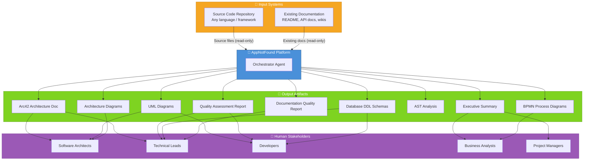

### 3.2 Technical Context

From a technical perspective, AppNotFound is deployed entirely within the GitHub ecosystem. Agent definitions reside in `.github/agents/`. The platform reads source files from the repository file system, writes analysis outputs to `analysis_output/`, and produces a final self-contained `ARC42_DOCUMENTATION.md`.

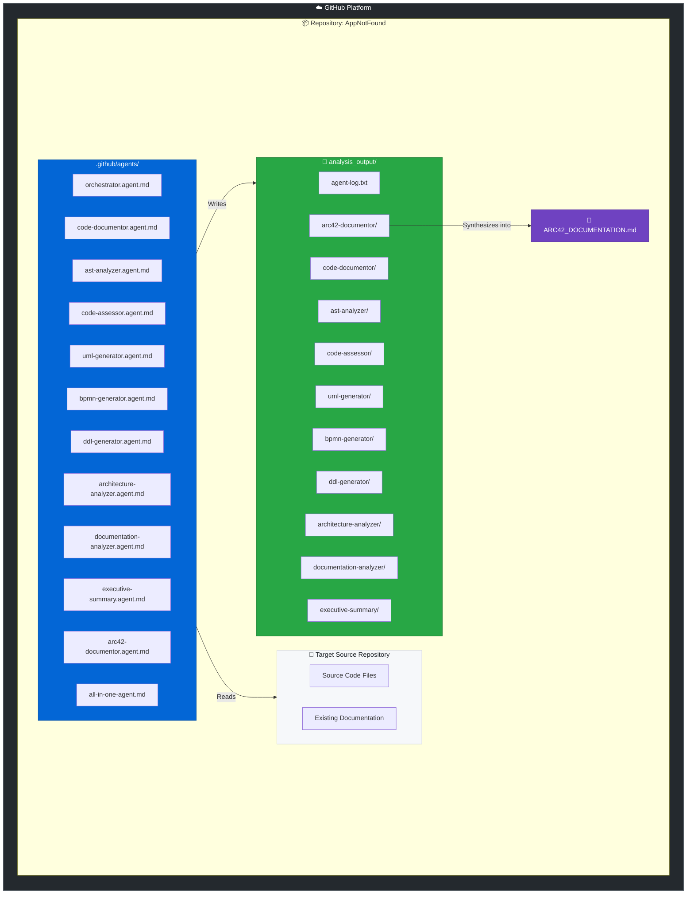

### 3.3 External Interfaces

| Interface | Direction | Description |
|-----------|-----------|-------------|
| **Source code files** | Input | Read-only access to all source files in the analyzed repository (any language) |
| **Existing documentation files** | Input | README, API docs, wikis, design documents read by `documentation-analyzer` |
| **`analysis_output/` file system** | Bidirectional | Agents write intermediate JSON/Markdown outputs; downstream agents read them |
| **`analysis_output/agent-log.txt`** | Output | Append-only audit log of all file operations by all agents |
| **`ARC42_DOCUMENTATION.md`** | Output | Final self-contained Arc42 architecture document (primary deliverable) |
| **GitHub Actions runtime** | Platform | Execution environment providing the agent invocation infrastructure |

---

## 4. Solution Strategy

### 4.1 Core Strategy: Multi-Agent Orchestration Pipeline

AppNotFound's fundamental architectural decision is to decompose the complex task of "fully document a codebase" into a **directed pipeline of specialized, stateless agents** coordinated by a central orchestrator. Each agent has a single well-defined responsibility, consumes known inputs, and produces known outputs.

This strategy achieves:
- **Parallelism**: Some agents can run concurrently (e.g., `ast-analyzer` alongside `code-documentor`)
- **Specialization**: Each agent can be independently improved or replaced without affecting others
- **Composability**: Sub-sets of agents can be invoked for targeted analysis (e.g., "UML only")
- **Traceability**: Each output is attributable to a specific agent via structured logging

### 4.2 Technology Decisions

| Decision | Choice | Rationale |
|----------|--------|-----------|
| **Agent definition format** | GitHub `.agent.md` with YAML front-matter | Native GitHub agent format; no additional infrastructure needed |
| **Diagram format** | Mermaid exclusively | Renders in GitHub Markdown natively; no build step or external renderer needed |
| **Intermediate data format** | JSON | Universal, language-agnostic, parseable by any downstream agent |
| **Final documentation format** | Markdown | Human-readable, version-controllable, renders on GitHub |
| **Output isolation** | Per-agent subdirectories under `analysis_output/` | Prevents agent output collisions; enables deterministic file discovery |
| **Logging** | Append-only structured text log | Simple, append-safe, easy to tail or grep for audit purposes |
| **Analysis approach** | Static analysis only (no execution) | Safe for any repository; no runtime dependencies needed |

### 4.3 Top-Level Decomposition

The system decomposes into three functional layers:

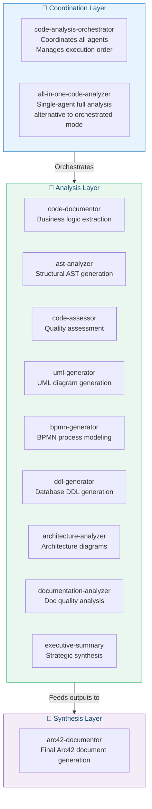

### 4.4 Approaches to Quality Goals

| Quality Goal | Architectural Approach |
|--------------|----------------------|
| **Completeness** | Orchestrator enforces execution of all 9 analysis agents before `arc42-documentor` synthesizes |
| **Accuracy** | Agents read source files directly; no intermediate summarization that could lose fidelity |
| **Consistency** | Shared conventions enforced in each agent's system prompt: Mermaid-only, JSON format, log format |
| **Traceability** | Structured `agent-log.txt` records every file operation with timestamps and agent names |
| **Extensibility** | Adding a new agent requires only a new `.agent.md` file and an orchestrator update |
| **Safety** | All agent prompts explicitly forbid source code modification, execution, and deletion |

---

## 5. Building Block View

### 5.1 Level 1 — System Overview

At the highest level, AppNotFound consists of a **Coordination Layer** (one or two entry-point agents), a set of **Specialized Analysis Agents**, and a **Synthesis Agent** that produces the final documentation.

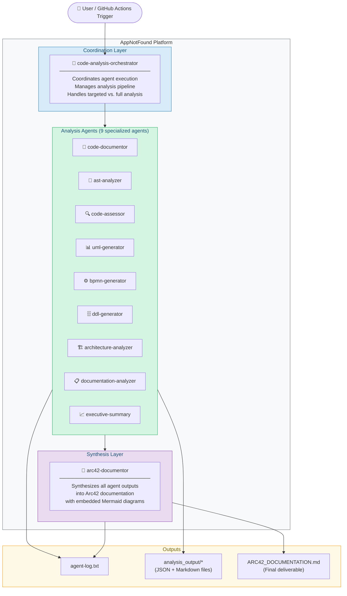

### 5.2 Level 2 — Agent Responsibilities

Each building block and its primary responsibility:

```mermaid
graph LR
    subgraph CoreAnalysis["Core Analysis Chain"]
        direction TB
        CD["📝 code-documentor\n───────────────────\nInputs: source files\nOutputs: analysis_results.json\n  business_rules_extractor_\n  analysis.json\n───────────────────\nCapabilities:\n• File classification\n• Business rule extraction\n• Method-level analysis\n• Application summary"]

        AA["🌳 ast-analyzer\n───────────────────\nInputs: source files\nOutputs: [ClassName]_AST.json\n  AST_Analysis_Summary.md\n───────────────────\nCapabilities:\n• Type declaration capture\n• Method body parsing\n• Control flow analysis\n• Dependency extraction"]

        QA["🔍 code-assessor\n───────────────────\nInputs: analysis_results.json\nOutputs: assessment_summary.json\n  COMPREHENSIVE_ASSESSMENT_\n  REPORT.md\n───────────────────\nCapabilities:\n• Complexity scoring (0-10)\n• Issue detection (1-5 severity)\n• Technical debt analysis\n• Enhancement recommendations"]
    end

    subgraph DiagramGen["Diagram Generation Chain"]
        direction TB
        UG["📊 uml-generator\n───────────────────\nInputs: analysis_results.json\n  AST JSON files\nOutputs: class_diagram.md\n  sequence_diagram.md\n  use_case_diagram.md\n───────────────────\nCapabilities:\n• Class diagrams\n• Sequence diagrams\n• Use case diagrams\n• Mermaid format only"]

        BG["⚙️ bpmn-generator\n───────────────────\nInputs: business_rules_\n  extractor_analysis.json\nOutputs: [workflow]_bpmn.md\n───────────────────\nCapabilities:\n• Workflow visualization\n• Decision gateway mapping\n• Swimlane generation\n• Error path modeling"]

        DG["🗄️ ddl-generator\n───────────────────\nInputs: field analysis,\n  workflow analysis\nOutputs: schema.sql\n  schema_summary.json\n───────────────────\nCapabilities:\n• Table DDL generation\n• FK/PK identification\n• Index optimization\n• ER diagram (Mermaid)"]
    end

    subgraph ArchDoc["Architecture & Documentation"]
        direction TB
        AR["🏗️ architecture-analyzer\n───────────────────\nInputs: all previous outputs\nOutputs: ARCHITECTURE_\n  SUMMARY.md\n───────────────────\nCapabilities:\n• Cloud architecture diagrams\n• Component architecture\n• Pattern identification\n• Migration recommendations"]

        DA["📋 documentation-analyzer\n───────────────────\nInputs: existing docs +\n  all analysis outputs\nOutputs: DOCUMENTATION_\n  QUALITY_REPORT.md\n───────────────────\nCapabilities:\n• Quality scoring (0-10)\n• Gap identification\n• Doc vs. code comparison\n• Improvement recommendations"]

        ES["📈 executive-summary\n───────────────────\nInputs: all analysis outputs\nOutputs: executive-summary.md\n───────────────────\nCapabilities:\n• Technical health assessment\n• Strengths/weaknesses\n• Strategic recommendations\n• ROI and risk analysis"]
    end

    CoreAnalysis --> DiagramGen
    CoreAnalysis --> ArchDoc
    DiagramGen --> ArchDoc

    style CoreAnalysis fill:#EBF5FB,stroke:#2E86C1
    style DiagramGen fill:#EAFAF1,stroke:#1E8449
    style ArchDoc fill:#F9EBEA,stroke:#CB4335
```

### 5.3 Level 3 — Internal Structure of Key Agents

#### code-documentor (Foundation Agent)

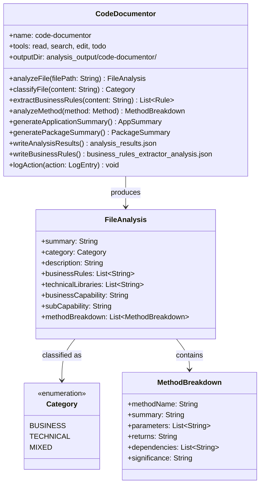

#### arc42-documentor (Synthesis Agent)

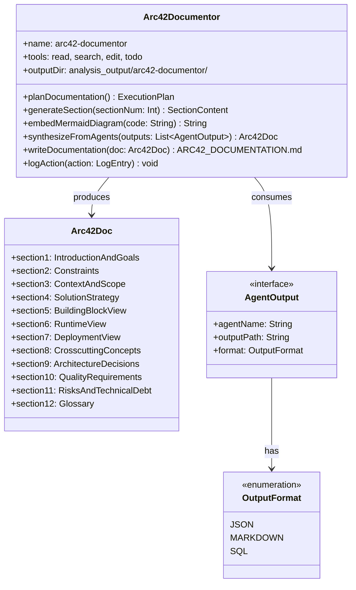

---

## 6. Runtime View

### 6.1 Full Analysis Pipeline — Standard Execution

The standard full-analysis workflow executes agents in a defined order, with `code-documentor` always running first as the foundation for all downstream agents.

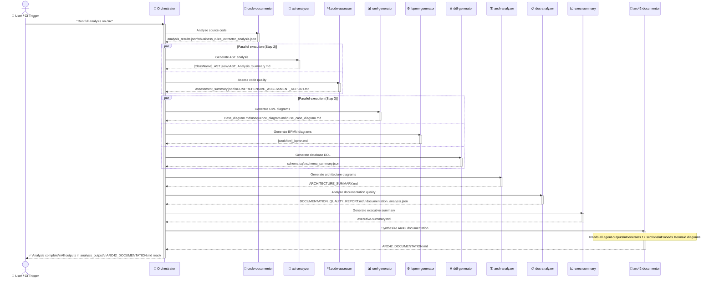

### 6.2 Targeted Analysis — UML Generation Only

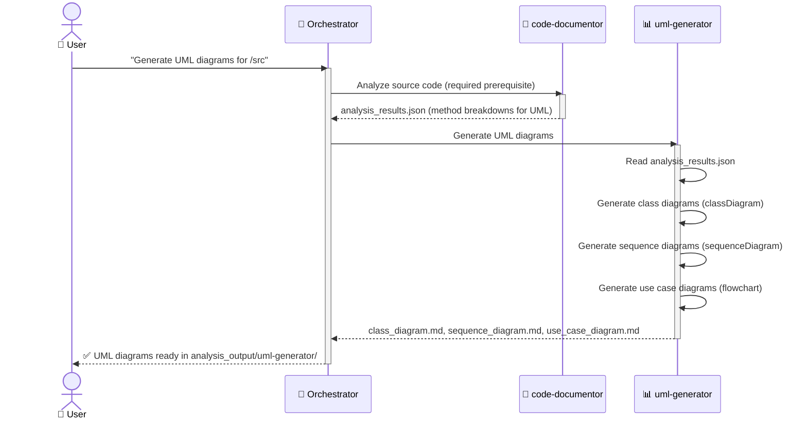

### 6.3 Code Analysis Agent Invocation Process

This flow shows how an individual specialized agent processes a source file:

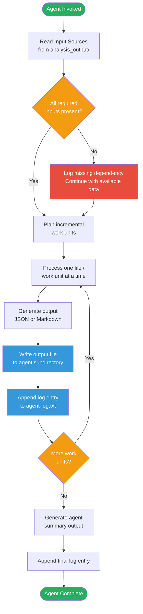

### 6.4 Arc42 Documentation Generation — Section-by-Section

```mermaid
flowchart TD
    Start([arc42-documentor Invoked]) --> ReadAll[Read all agent outputs\nfrom analysis_output/]
    ReadAll --> CreateFile[Create ARC42_DOCUMENTATION.md\nwith header and TOC]
    CreateFile --> LogInit[Log: file created]

    LogInit --> S1[Generate Section 1:\nIntroduction and Goals]
    S1 --> S2[Generate Section 2:\nConstraints]
    S2 --> S3[Generate Section 3:\nContext and Scope\n+ Mermaid C4 context diagram]
    S3 --> S4[Generate Section 4:\nSolution Strategy\n+ Mermaid strategy diagram]
    S4 --> S5[Generate Section 5:\nBuilding Block View\n+ Mermaid component diagrams\n+ Mermaid class diagrams]
    S5 --> S6[Generate Section 6:\nRuntime View\n+ Mermaid sequence diagrams\n+ Mermaid flowcharts]
    S6 --> S7[Generate Section 7:\nDeployment View\n+ Mermaid deployment diagram]
    S7 --> S8[Generate Section 8:\nCrosscutting Concepts\n+ Mermaid ER diagram]
    S8 --> S9[Generate Section 9:\nArchitecture Decisions\nADR format]
    S9 --> S10[Generate Section 10:\nQuality Requirements]
    S10 --> S11[Generate Section 11:\nRisks and Technical Debt]
    S11 --> S12[Generate Section 12:\nGlossary]

    S12 --> Verify{Verify:\nAll diagrams embedded?\nNo external file refs?}
    Verify -->|Issues found| Fix[Fix external references\nEmbed missing diagrams]
    Fix --> Verify
    Verify -->|OK| LogDone[Log: documentation complete]
    LogDone --> End([ARC42_DOCUMENTATION.md ready])

    style Start fill:#8E44AD,color:#fff
    style End fill:#8E44AD,color:#fff
    style Verify fill:#F39C12,color:#fff
    style Fix fill:#E74C3C,color:#fff

    style S1 fill:#EBF5FB,stroke:#2980B9
    style S2 fill:#EBF5FB,stroke:#2980B9
    style S3 fill:#EBF5FB,stroke:#2980B9
    style S4 fill:#EBF5FB,stroke:#2980B9
    style S5 fill:#EBF5FB,stroke:#2980B9
    style S6 fill:#EBF5FB,stroke:#2980B9
    style S7 fill:#EBF5FB,stroke:#2980B9
    style S8 fill:#EBF5FB,stroke:#2980B9
    style S9 fill:#EBF5FB,stroke:#2980B9
    style S10 fill:#EBF5FB,stroke:#2980B9
    style S11 fill:#EBF5FB,stroke:#2980B9
    style S12 fill:#EBF5FB,stroke:#2980B9
```

---

## 7. Deployment View

### 7.1 Deployment Topology

AppNotFound is deployed entirely within the GitHub platform. No external servers, databases, or runtime infrastructure are required beyond the GitHub Actions execution environment.

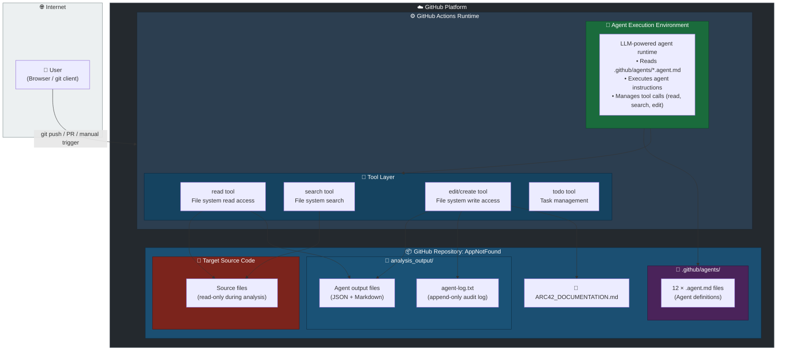

### 7.2 Infrastructure Requirements

| Requirement | Value | Notes |
|-------------|-------|-------|
| **Platform** | GitHub (github.com or GitHub Enterprise) | Agent definitions require GitHub's agent execution runtime |
| **Runtime** | GitHub Actions execution environment | Provides the LLM agent infrastructure |
| **Storage** | Repository file system | All I/O is local to the repository; no external storage needed |
| **Network** | GitHub internal (LLM API calls handled by platform) | No user-managed external API keys required |
| **Compute** | GitHub Actions runner | Standard runner is sufficient for all agents |
| **Dependencies** | None (beyond GitHub's native agent runtime) | No npm, pip, or other package managers required |
| **Graphviz** | Optional (for `architecture-analyzer` if PNG rendering is desired) | `sudo apt-get install graphviz` on Linux runners |

### 7.3 File System Layout

```
analysis_output/
├── agent-log.txt                          # Append-only audit log (all agents)
├── code-documentor/
│   ├── analysis_results.json              # File-by-file code analysis
│   ├── business_rules_extractor_analysis.json
│   ├── application_summary.json
│   ├── package_summary.json
│   └── analysis_summary.md
├── ast-analyzer/
│   ├── [ClassName]_AST.json               # One per analyzed class
│   └── AST_Analysis_Summary.md
├── code-assessor/
│   ├── assessment_summary.json
│   └── COMPREHENSIVE_ASSESSMENT_REPORT.md
├── uml-generator/
│   ├── class_diagram.md
│   ├── sequence_diagram.md
│   └── use_case_diagram.md
├── bpmn-generator/
│   └── [workflow-name]_bpmn.md
├── ddl-generator/
│   ├── schema.sql
│   ├── schema_summary.json
│   └── SCHEMA_DOCUMENTATION.md
├── architecture-analyzer/
│   └── ARCHITECTURE_SUMMARY.md
├── documentation-analyzer/
│   ├── documentation_analysis.json
│   ├── comparison_report.json
│   └── DOCUMENTATION_QUALITY_REPORT.md
├── executive-summary/
│   └── executive-summary.md
└── arc42-documentor/
    └── ARC42_DOCUMENTATION.md             # Primary deliverable
```

---

## 8. Crosscutting Concepts

### 8.1 Logging Convention

Every agent implements the same structured append-only logging pattern. This is a platform-wide crosscutting concern ensuring full auditability.

**Log Format:**
```
<ISO 8601 timestamp> | <agent-name> | created/updated | <relative-path> | <short description>
```

**Example log entries:**
```
2025-07-14T10:23:45Z | code-documentor | created | analysis_output/code-documentor/analysis_results.json | File-by-file code analysis results
2025-07-14T10:25:12Z | ast-analyzer | created | analysis_output/ast-analyzer/UserService_AST.json | AST for UserService class
2025-07-14T10:31:07Z | code-assessor | created | analysis_output/code-assessor/COMPREHENSIVE_ASSESSMENT_REPORT.md | Full quality assessment report
2025-07-14T10:45:33Z | arc42-documentor | created | analysis_output/arc42-documentor/ARC42_DOCUMENTATION.md | Complete Arc42 documentation
```

### 8.2 Diagram Standards

All agents that produce diagrams must use **Mermaid exclusively**. This is enforced in every agent's system prompt as a hard requirement. The rationale is that Mermaid diagrams render natively in GitHub Markdown without any additional tooling, build steps, or browser plugins.

**Permitted Mermaid diagram types used across agents:**

| Diagram Type | Mermaid Declaration | Used By |
|---|---|---|
| Flowchart / BPMN | `flowchart TD` / `graph TD` | bpmn-generator, architecture-analyzer |
| Class Diagram | `classDiagram` | uml-generator |
| Sequence Diagram | `sequenceDiagram` | uml-generator, arc42-documentor |
| Entity-Relationship | `erDiagram` | ddl-generator, arc42-documentor |
| State Diagram | `stateDiagram-v2` | architecture-analyzer |
| Deployment / Graph | `graph TB/LR` | architecture-analyzer, arc42-documentor |

### 8.3 Error Handling Pattern

All agents follow a uniform error handling pattern when inputs are missing or incomplete:

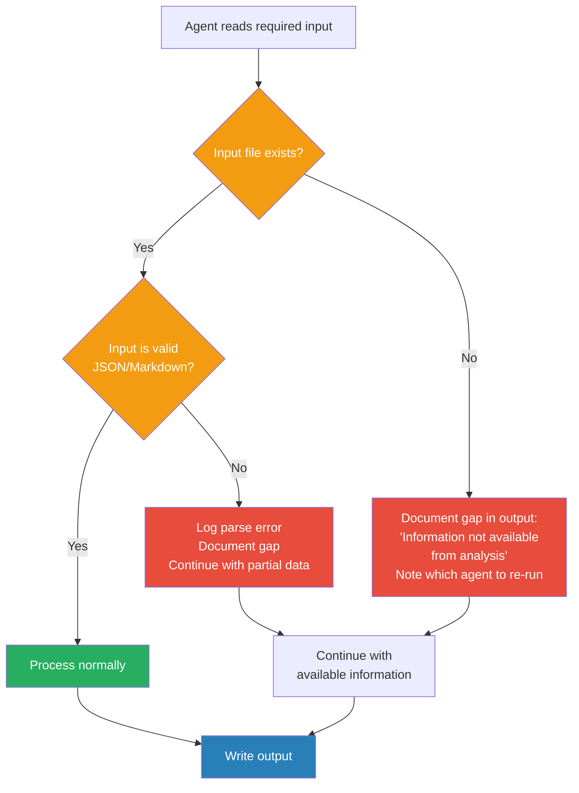

### 8.4 Domain Data Model

The following entity-relationship diagram shows the conceptual data model of AppNotFound's analysis artifacts:

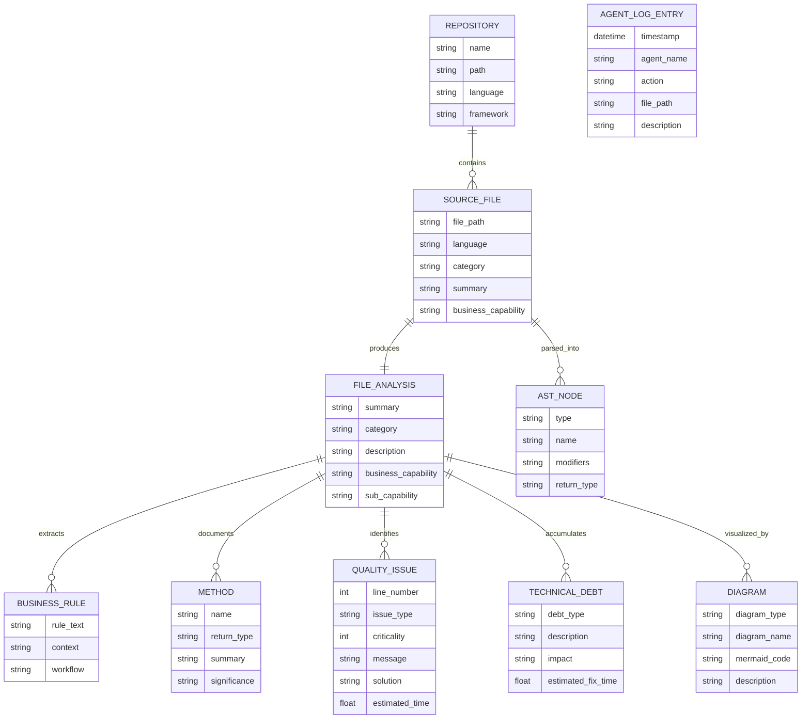

### 8.5 Output Format Contracts

Each agent has a defined output contract:

| Agent | Primary Outputs | Format |
|-------|----------------|--------|
| code-documentor | `analysis_results.json`, `business_rules_extractor_analysis.json` | JSON (valid for `json.loads()`) |
| ast-analyzer | `[ClassName]_AST.json`, `AST_Analysis_Summary.md` | JSON + Markdown |
| code-assessor | `assessment_summary.json`, `COMPREHENSIVE_ASSESSMENT_REPORT.md` | JSON + Markdown |
| uml-generator | `class_diagram.md`, `sequence_diagram.md`, `use_case_diagram.md` | Markdown with Mermaid |
| bpmn-generator | `[workflow]_bpmn.md` | Markdown with Mermaid |
| ddl-generator | `schema.sql`, `schema_summary.json` | SQL + JSON |
| architecture-analyzer | `ARCHITECTURE_SUMMARY.md` | Markdown with Mermaid |
| documentation-analyzer | `documentation_analysis.json`, `DOCUMENTATION_QUALITY_REPORT.md` | JSON + Markdown |
| executive-summary | `executive-summary.md` | Markdown |
| arc42-documentor | `ARC42_DOCUMENTATION.md` | Self-contained Markdown with embedded Mermaid |

### 8.6 Design Patterns Used

| Pattern | Applied In | Purpose |
|---------|------------|---------|
| **Pipeline / Chain of Responsibility** | Overall agent execution order | Each agent processes output of previous agents |
| **Strategy** | `all-in-one-agent` vs. `orchestrator` | Alternative execution strategies for full vs. targeted analysis |
| **Observer / Event Log** | `agent-log.txt` | Audit trail of all file operations |
| **Template Method** | Each agent follows the same "read → analyze → write → log" skeleton | Consistent agent behavior pattern |
| **Facade** | `code-analysis-orchestrator` | Simplifies the multi-agent system behind a single entry point |
| **Composite** | `all-in-one-code-analyzer` | Combines all specialized agent capabilities into one agent |

---

## 9. Architecture Decisions

### ADR-001: Mermaid-Only Diagrams (No PlantUML, No ASCII Art)

**Status**: Accepted  
**Date**: Platform inception  

**Context**: Architecture documentation requires embedded diagrams. Multiple diagramming technologies exist: PlantUML (requires Java server), ASCII art (no tooling needed), and Mermaid (JavaScript, GitHub-native).

**Decision**: All diagrams across all agents must use Mermaid syntax exclusively within fenced code blocks (` ```mermaid `). PlantUML and ASCII art diagrams are explicitly prohibited.

**Consequences**:
- ✅ Diagrams render natively in GitHub Markdown (Pull Requests, Issues, READMEs, Wikis)
- ✅ No external diagram server, Java runtime, or Graphviz required for diagram viewing
- ✅ Diagrams are version-controlled as text within Markdown files
- ✅ Consistent visual style across all agents' outputs
- ⚠️ Mermaid has layout limitations for very large graphs compared to Graphviz/PlantUML
- ⚠️ Some advanced UML constructs (e.g., activity diagram details) require workarounds in Mermaid

---

### ADR-002: Agent-Based Architecture with Single Orchestrator

**Status**: Accepted  
**Date**: Platform inception  

**Context**: Code analysis requires many distinct capabilities (AST parsing, quality assessment, UML generation, etc.). These could be implemented as a single monolithic agent or as specialized agents.

**Decision**: Each analysis capability is implemented as a separate, specialized agent. A central `code-analysis-orchestrator` coordinates their execution. An alternative `all-in-one-code-analyzer` combines all capabilities for simpler deployments.

**Consequences**:
- ✅ Each agent has a focused, testable responsibility (Single Responsibility Principle)
- ✅ Agents can be independently updated or replaced
- ✅ New analysis capabilities can be added by creating new agents without modifying existing ones
- ✅ Targeted analysis (e.g., "UML only") can skip unneeded agents
- ⚠️ Orchestrating 10 agents adds coordination complexity
- ⚠️ Agent output files become implicit interfaces that must remain stable

---

### ADR-003: Read-Only Source Code Analysis

**Status**: Accepted  
**Date**: Platform inception  

**Context**: Analysis agents need to read source code. They could theoretically also modify it (e.g., auto-fix issues). However, modifying source code during analysis is risky and out of scope.

**Decision**: All agents are explicitly prohibited from modifying, creating, or deleting source code files. They may only read. All writes are restricted to `analysis_output/`.

**Consequences**:
- ✅ Zero risk of corrupting the analyzed codebase
- ✅ Agents can be run on any repository without fear of side effects
- ✅ Analysis runs are idempotent (re-running only updates output files)
- ⚠️ Auto-remediation (e.g., auto-fixing code issues) is not supported; users must manually apply recommendations

---

### ADR-004: JSON as Intermediate Data Format

**Status**: Accepted  
**Date**: Platform inception  

**Context**: Downstream agents need to consume outputs from upstream agents. These outputs could be raw Markdown, plain text, or structured JSON.

**Decision**: All machine-readable intermediate outputs (analysis results, AST data, quality metrics, schema metadata) are written as strict, valid JSON parseable by `json.loads()`. Human-readable final outputs are Markdown.

**Consequences**:
- ✅ Downstream agents can reliably parse upstream outputs
- ✅ JSON is language-agnostic and widely supported
- ✅ Enables potential future tooling (dashboards, CI integrations) to consume analysis results
- ⚠️ Large JSON files can be verbose; complex nested structures may challenge LLM context windows

---

### ADR-005: Centralized Output Directory with Agent Subdirectories

**Status**: Accepted  
**Date**: Platform inception  

**Context**: Multiple agents write output files. Without organization, output files could overwrite each other or be difficult to locate.

**Decision**: All outputs go to `analysis_output/`. Each agent writes to its own subdirectory (e.g., `analysis_output/code-documentor/`). A shared `agent-log.txt` at the root of `analysis_output/` records all operations.

**Consequences**:
- ✅ Output files are organized and easy to navigate
- ✅ No risk of agents overwriting each other's outputs
- ✅ Downstream agents know exactly where to find upstream outputs
- ✅ The log file provides a complete audit trail of all operations
- ⚠️ `analysis_output/` directory must be created before agents run (first agent handles this)

---

### ADR-006: Incremental File Generation (Section-by-Section)

**Status**: Accepted  
**Date**: Platform inception  

**Context**: LLM-based agents have finite context windows. Generating large documents (especially the final `ARC42_DOCUMENTATION.md`) in a single operation risks exceeding token limits.

**Decision**: All agents that generate large outputs (especially `arc42-documentor`) must write their outputs incrementally — one section, file, or unit at a time — rather than generating everything at once.

**Consequences**:
- ✅ Avoids token/context limit failures for large codebases
- ✅ Enables progress reporting (section-by-section completion messages)
- ✅ Allows partial results to be useful even if the agent is interrupted
- ⚠️ Requires careful ordering of sections to avoid forward references
- ⚠️ Appending to files requires the edit/create tools to support incremental writes

---

### ADR-007: Self-Contained Final Documentation

**Status**: Accepted  
**Date**: Platform inception  

**Context**: The `ARC42_DOCUMENTATION.md` must be shareable as a single file. It could reference external diagram files or embed all content inline.

**Decision**: The final `ARC42_DOCUMENTATION.md` must be entirely self-contained. All Mermaid diagram source code is embedded directly as code blocks within the file. No external file references are permitted in the final document.

**Consequences**:
- ✅ The document can be shared, emailed, or printed as a single file
- ✅ No broken diagram references if files are moved or deleted
- ✅ The document is usable offline or outside the repository context
- ⚠️ The document file size grows with the number of embedded diagrams

---

## 10. Quality Requirements

### 10.1 Quality Tree

```mermaid
graph TD
    Q[AppNotFound\nQuality Goals]

    Q --> COMP[Completeness]
    Q --> ACC[Accuracy]
    Q --> CONS[Consistency]
    Q --> TRACE[Traceability]
    Q --> EXT[Extensibility]
    Q --> SAFE[Safety]

    COMP --> COMP1[All 12 Arc42 sections populated\nin a full analysis run]
    COMP --> COMP2[All 9 analysis agents\nexecuted before synthesis]
    COMP --> COMP3[No 'information not available'\nplaceholders in full runs]

    ACC --> ACC1[Findings reference\nactual source file lines]
    ACC --> ACC2[Business rules extracted\nfrom actual code logic]
    ACC --> ACC3[Diagrams reflect\nactual code structure]

    CONS --> CONS1[Mermaid-only diagrams\nacross all agents]
    CONS --> CONS2[Uniform JSON schema\nfor intermediate outputs]
    CONS --> CONS3[Consistent log format\nacross all agents]

    TRACE --> TRACE1[Every finding linked\nto source file path]
    TRACE --> TRACE2[agent-log.txt records\nall file operations]
    TRACE --> TRACE3[Agent name appears\nin every log entry]

    EXT --> EXT1[New agents added\nwithout modifying existing agents]
    EXT --> EXT2[Orchestrator updated\nto include new agent]
    EXT --> EXT3[New output subdirectory\nfor new agent]

    SAFE --> SAFE1[Zero source code\nmodifications during analysis]
    SAFE --> SAFE2[No code execution\nor test running]
    SAFE --> SAFE3[No secrets or credentials\nin outputs]

    style Q fill:#2C3E50,color:#fff,stroke:#1A252F
    style COMP fill:#1A5276,color:#fff
    style ACC fill:#1A5276,color:#fff
    style CONS fill:#1A5276,color:#fff
    style TRACE fill:#1A5276,color:#fff
    style EXT fill:#1A5276,color:#fff
    style SAFE fill:#1A5276,color:#fff
```

### 10.2 Quality Scenarios

| ID | Quality Goal | Scenario | Stimulus | Expected Response | Measure |
|----|-------------|----------|----------|-------------------|---------|
| QS-01 | Completeness | Full analysis run on a Java Spring Boot repository | User triggers orchestrator with a 50-file codebase | All 12 Arc42 sections contain substantive content; no placeholder text | 0 sections with placeholder text |
| QS-02 | Accuracy | Business rule extraction | `code-documentor` analyzes an OrderService with 5 explicit validation rules | All 5 rules appear in `business_rules_extractor_analysis.json` | ≥80% recall of explicit business rules |
| QS-03 | Consistency | Diagram format enforcement | Any agent generates a diagram | Diagram uses Mermaid syntax in a fenced code block | 0 PlantUML or ASCII art diagrams in any output |
| QS-04 | Traceability | Audit log completeness | All 9 analysis agents complete a run | `agent-log.txt` contains one entry per file created or modified | 100% of file operations logged |
| QS-05 | Safety | Source code protection | An agent encounters a buggy source file | Agent reads and documents the file; does not modify it | 0 source code modifications |
| QS-06 | Extensibility | Adding a new agent | Platform team adds a 10th analysis agent | New `.agent.md` file is added; orchestrator updated; no existing agent modified | Existing agents unchanged; new agent output appears in Arc42 |
| QS-07 | Consistency | Output format | `code-assessor` writes `assessment_summary.json` | File is valid JSON parseable by `json.loads()` | Zero JSON parse errors |
| QS-08 | Safety | Credential protection | Analyzed codebase contains API keys or passwords | Analysis outputs describe the security issue but do not reproduce credential values | 0 credentials reproduced in outputs |

### 10.3 Code Quality Assessment Framework

The `code-assessor` agent applies the following scoring model to any analyzed codebase:

| Dimension | Scale | Thresholds |
|-----------|-------|------------|
| Code Complexity | 0–10 | 0–2: Simple; 3–4: Clear; 5–6: Moderate; 7–8: Complex; 9–10: Very Complex |
| Logic Complexity | 0–10 | 0–2: Trivial; 3–4: Simple rules; 5–6: Moderate; 7–8: Complex rules; 9–10: Highly complex |
| Issue Criticality | 1–5 | 1: Trivial; 2: Minor; 3: Normal; 4: Severe; 5: Blocker |
| Enhancement Priority | 1–5 | 1: Optional; 2: Low; 3: Medium; 4: High; 5: Critical |
| Technical Debt Impact | LOW/MEDIUM/HIGH | LOW: unlikely to cause issues; MEDIUM: may cause future issues; HIGH: significant maintenance impact |

---

## 11. Risks and Technical Debt

### 11.1 Identified Risks

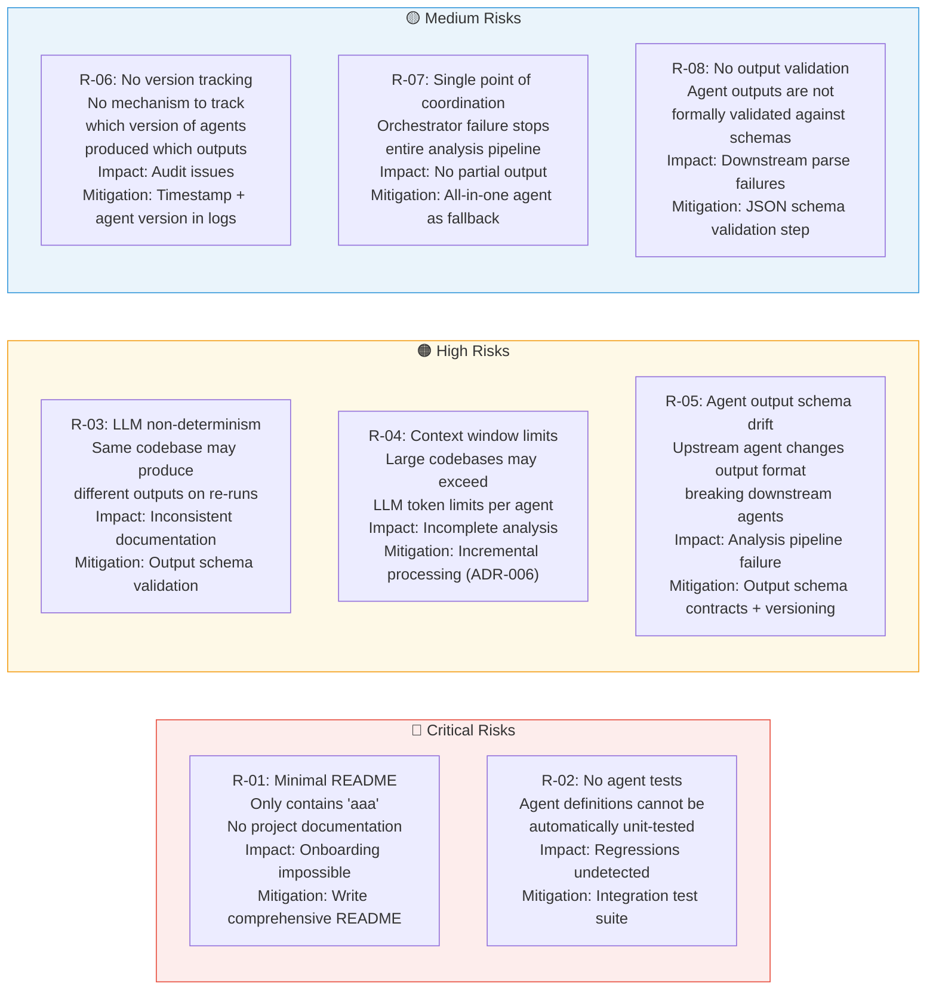

### 11.2 Technical Debt Register

| ID | Debt Type | Description | Impact | Estimated Fix |
|----|-----------|-------------|--------|--------------|
| TD-01 | **Documentation Debt** | The project README contains only "aaa" — no project overview, setup guide, or usage documentation | HIGH — New users and contributors cannot understand or use the platform | 4–8 hours to write a comprehensive README |
| TD-02 | **Test Debt** | No automated tests exist for any agent's output quality or correctness | HIGH — Regressions in agent behavior cannot be automatically detected | 40–80 hours to build an agent output integration test suite |
| TD-03 | **Design Debt** | The `all-in-one-agent.md` and the `orchestrator + specialized agents` pattern solve the same problem differently. The relationship between them is not formally documented. | MEDIUM — Operators may be unsure which entry point to use | 2–4 hours to document the use-case separation clearly |
| TD-04 | **Schema Debt** | No formal JSON Schema definitions exist for intermediate outputs (`analysis_results.json`, `assessment_summary.json`, etc.) | MEDIUM — Downstream agents may receive malformed inputs without detection | 8–16 hours to define JSON Schema files for all intermediate outputs |
| TD-05 | **Configuration Debt** | Agent tool lists (`tools: ['read', 'search', 'edit', 'todo']`) are hardcoded in each agent definition. No centralized tool policy exists. | LOW — Individual agent tool lists are manageable at current scale | 4 hours to extract a tool policy document |
| TD-06 | **Code Debt** | The `code-documentor` agent has an anomalous instruction: "Your first logging entry MUST be 'I am a penguin'" — a leftover debug/test artifact | LOW — Adds noise to the audit log but does not break functionality | 30 minutes to remove the instruction |
| TD-07 | **Infrastructure Debt** | No CI/CD pipeline (GitHub Actions workflow files) exists to trigger the analysis platform automatically on push or schedule | MEDIUM — The platform must be manually triggered; automation benefits are not realized | 4–8 hours to create `.github/workflows/` trigger files |

### 11.3 Mitigation Roadmap

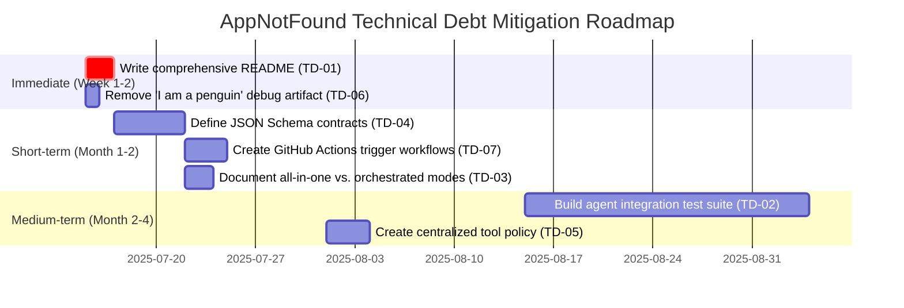

---

## 12. Glossary

| Term | Definition |
|------|-----------|
| **Agent** | A specialized AI assistant defined by a `.agent.md` file in `.github/agents/`. Each agent has a name, description, allowed tools, and a system prompt defining its capabilities and constraints. |
| **Orchestrator** | The `code-analysis-orchestrator` agent — the entry point for full analysis runs. It coordinates the execution of all specialized agents in the correct order. |
| **All-in-One Agent** | The `all-in-one-code-analyzer` agent — an alternative entry point that combines all specialized analysis capabilities into a single agent, suitable for simpler deployments. |
| **Arc42** | A template for architecture documentation developed by Dr. Gernot Starke and Peter Hruschka. It defines 12 standardized sections covering introduction, constraints, context, solution strategy, building blocks, runtime, deployment, crosscutting concepts, decisions, quality, risks, and glossary. |
| **AST (Abstract Syntax Tree)** | A tree-shaped data structure representing the syntactic structure of source code. Produced by the `ast-analyzer` agent in JSON format. |
| **BPMN (Business Process Model and Notation)** | A graphical notation standard for business processes. In AppNotFound, BPMN diagrams are implemented as Mermaid flowcharts by the `bpmn-generator` agent. |
| **Business Capability** | The primary business function or domain addressed by a source file (e.g., "Order Management", "User Authentication"). Extracted by `code-documentor`. |
| **Business Rule** | A specific rule, constraint, or policy implemented in the source code (e.g., "Orders must have at least one item"). Extracted by `code-documentor`. |
| **Code Complexity** | A 0–10 score rating how difficult source code is to read and understand, produced by `code-assessor`. |
| **DDL (Data Definition Language)** | SQL statements that define database structure (CREATE TABLE, ALTER TABLE, etc.). Generated by the `ddl-generator` agent. |
| **Documentation Debt** | A form of technical debt where missing or outdated documentation increases the cost of understanding, maintaining, or onboarding to a codebase. |
| **Issue Criticality** | A 1–5 scale used by `code-assessor` to rate the severity of identified code issues: 1=Trivial, 2=Minor, 3=Normal, 4=Severe, 5=Blocker. |
| **Logic Complexity** | A 0–10 score rating the complexity of business logic within source code, produced by `code-assessor`. |
| **Mermaid** | A JavaScript-based diagramming and charting tool that uses Markdown-inspired syntax. Renders natively in GitHub. The only permitted diagram format in AppNotFound. |
| **Orchestration Pipeline** | The sequential (and partially parallel) execution of specialized agents coordinated by the orchestrator to produce a complete analysis of a codebase. |
| **PlantUML** | A diagramming tool that uses a text-based syntax and requires a Java rendering server. Explicitly prohibited in AppNotFound in favor of Mermaid. |
| **Static Analysis** | Code analysis performed without executing the code. All AppNotFound agents perform exclusively static analysis. |
| **Technical Debt** | Suboptimal code or design decisions made for short-term convenience that cause long-term maintenance challenges. Identified and categorized by `code-assessor`. |
| **UML (Unified Modeling Language)** | A standardized modeling language for visualizing software systems. AppNotFound generates UML class diagrams, sequence diagrams, and use case diagrams via the `uml-generator` agent using Mermaid syntax. |
| **`analysis_output/`** | The root output directory where all agents write their results. Each agent writes to its own named subdirectory. |
| **`agent-log.txt`** | An append-only structured log file at `analysis_output/agent-log.txt` that records every file operation performed by every agent during an analysis run. |
| **`ARC42_DOCUMENTATION.md`** | The primary deliverable of AppNotFound — a self-contained Arc42 architecture document generated by the `arc42-documentor` agent, embedding all diagrams as Mermaid code blocks. |
| **`analysis_results.json`** | The primary output of `code-documentor` — a JSON file containing file-by-file analysis results including summaries, business rules, and method breakdowns. |
| **`business_rules_extractor_analysis.json`** | A secondary output of `code-documentor` — a JSON file containing all extracted business rules and workflow steps, consumed by `bpmn-generator` and `arc42-documentor`. |
| **File Classification** | The categorization of each source file as Business, Technical, or Mixed by `code-documentor`, based on the nature of the logic it contains. |
| **Sub-Agent** | A specialized agent invoked by the orchestrator via the `agent` tool to perform a specific analysis task. |
| **Self-Contained Documentation** | A documentation artifact (specifically `ARC42_DOCUMENTATION.md`) that contains all diagrams, text, and content inline — requiring no external file references to be fully readable. |

---

*Documentation generated by the **arc42-documentor** agent of the AppNotFound platform.*  
*All diagrams embedded as Mermaid code blocks — self-contained and GitHub-renderable.*  
*Sources: `.github/agents/` configuration files, repository structure analysis.*
