# Architecture Documentation (Arc42)

**Project**: ComplianceApp-022 (AppNotFound)
**Version**: 0.1.0 — Initial Architecture Baseline
**Date**: 2025-01-01
**Generated by**: Arc42 Documentation Generator (arc42-documentor agent)
**Status**: 🟡 Draft — sections marked `[TBD]` must be completed by the project team
**Intended path**: `docs/arc42/arc42-documentation.md` _(move here once the directory is created)_

---

> **Note on source data**: This document was generated for a greenfield repository
> (`AppNotFound / ComplianceApp-022`) that currently contains only a `README.md` stub and a
> set of AI-agent skill definitions under `.github/agents/`. All architectural content is
> therefore based on: (a) the project identifier **ComplianceApp-022** and established
> compliance-application domain conventions, (b) the multi-agent automation framework
> visible in `.github/agents/`, and (c) Arc42 best practices. Every section that requires
> real implementation data is clearly marked `[TBD]` or `[PLACEHOLDER]` so the team can
> iterate as the codebase grows.

---

## Table of Contents

1. [Introduction and Goals](#1-introduction-and-goals)
2. [Architecture Constraints](#2-architecture-constraints)
3. [System Scope and Context](#3-system-scope-and-context)
4. [Solution Strategy](#4-solution-strategy)
5. [Building Block View](#5-building-block-view)
6. [Runtime View](#6-runtime-view)
7. [Deployment View](#7-deployment-view)
8. [Cross-cutting Concepts](#8-cross-cutting-concepts)
9. [Architecture Decisions](#9-architecture-decisions)
10. [Quality Requirements](#10-quality-requirements)
11. [Risks and Technical Debt](#11-risks-and-technical-debt)
12. [Glossary](#12-glossary)

---

## 1. Introduction and Goals

### 1.1 Business Context and Purpose

**ComplianceApp-022** (internally referred to as *AppNotFound*) is a compliance management
platform designed to help organisations track, manage, and audit their adherence to
regulatory frameworks, internal policies, and industry standards.

The system is at a **pre-implementation / greenfield** stage. The name suffix `-022`
suggests this may be the 22nd iteration of a family of compliance tools, implying that
prior generations exist and that migration / interoperability concerns will be relevant.

#### Primary Business Goals

| # | Goal | Priority |
|---|------|----------|
| BG-01 | Enable end-to-end tracking of compliance obligations across regulatory frameworks | HIGH |
| BG-02 | Automate evidence collection and control mapping | HIGH |
| BG-03 | Provide real-time compliance posture dashboards to leadership | MEDIUM |
| BG-04 | Support audit workflows including external auditor collaboration | MEDIUM |
| BG-05 | Integrate with upstream IT-asset and identity systems to reduce manual effort | MEDIUM |
| BG-06 | Maintain immutable audit trails for all compliance-related activities | HIGH |

### 1.2 Quality Goals

The top quality goals (in priority order) that shape architectural decisions:

| Priority | Quality Goal | Scenario / Motivation |
|----------|-------------|----------------------|
| 1 | **Data Integrity** | Compliance records must be tamper-evident; any modification must be logged |
| 2 | **Security** | Sensitive regulatory data requires role-based access control and encryption at rest/in-transit |
| 3 | **Auditability** | Every state-change must produce an immutable audit-trail entry queryable by external auditors |
| 4 | **Availability** | Compliance dashboards must be accessible 99.5 % of business hours |
| 5 | **Extensibility** | New regulatory frameworks (e.g. GDPR, SOC 2, ISO 27001) must be onboardable without code changes |
| 6 | **Usability** | Non-technical compliance officers must be able to manage obligations without developer assistance |

### 1.3 Stakeholders

| Role | Abbreviation | Concerns |
|------|-------------|---------|
| Compliance Officer | CO | Day-to-day obligation tracking, evidence upload, reporting |
| Chief Risk Officer | CRO | Executive dashboards, risk posture, trend analytics |
| Internal Auditor | IA | Audit-trail access, control testing, issue management |
| External Auditor | EA | Read-only access to evidence packages; export capabilities |
| IT Security Team | IT-SEC | Integration with SIEM, IAM; security controls mapping |
| Developer / DevOps | DEV | APIs, CI/CD integration, automated compliance scanning |
| System Administrator | SYS-ADM | User management, system health, backup & recovery |
| Regulatory Body | REG | [External] Receives compliance reports / submissions |

---

## 2. Architecture Constraints

### 2.1 Technical Constraints

| ID | Constraint | Rationale |
|----|-----------|----------|
| TC-01 | All data at rest must be encrypted (AES-256 or equivalent) | Regulatory requirement for sensitive compliance data |
| TC-02 | All data in transit must use TLS 1.2+ | Industry standard; required by most compliance frameworks |
| TC-03 | Authentication must support SSO / SAML 2.0 or OIDC | Enterprise integration requirement |
| TC-04 | The system must produce WCAG 2.1 AA-compliant user interfaces | Accessibility regulation compliance |
| TC-05 | Audit logs must be write-once / append-only | Tamper-evidence requirement |
| TC-06 | The system must support multi-tenancy from day one | SaaS delivery model assumed |
| TC-07 | APIs must follow REST or GraphQL conventions and be versioned | Integration partner requirement |
| TC-08 | The build, test, and deploy pipeline must be fully automated | DevOps maturity requirement |
| TC-09 | `[TBD]` — primary programming language(s) | To be decided by engineering team |
| TC-10 | `[TBD]` — target cloud provider (AWS / Azure / GCP / on-prem) | To be decided based on procurement |

### 2.2 Organisational Constraints

| ID | Constraint | Rationale |
|----|-----------|----------|
| OC-01 | The project follows a domain-driven design (DDD) approach | Alignment with complex compliance domain model |
| OC-02 | Architecture decisions must be recorded as ADRs | Traceability and knowledge retention |
| OC-03 | Each service must have a designated owning team | Conway's Law / team topology alignment |
| OC-04 | Third-party dependencies must pass a security review before adoption | Supply-chain security policy |
| OC-05 | GDPR data residency requirements apply; EU data must stay in EU regions | Legal requirement |
| OC-06 | `[TBD]` — target release date | To be defined by product management |

### 2.3 Conventions

| ID | Convention | Scope |
|----|-----------|-------|
| CV-01 | Arc42 is the mandated architecture documentation template | All architecture docs |
| CV-02 | Mermaid is the mandated diagramming format (no PlantUML, no ASCII art) | All diagrams |
| CV-03 | Semantic versioning (SemVer) for all software artefacts | Releases |
| CV-04 | English as the lingua franca for all code, docs, and ADRs | Codebase & docs |
| CV-05 | Git-flow branching model | Source control |
| CV-06 | All agents follow the naming convention `<name>.agent.md` | AI automation layer |

---

## 3. System Scope and Context

### 3.1 Business Context

ComplianceApp-022 sits at the centre of the compliance ecosystem. External actors interact
with it via web/mobile interfaces or machine-to-machine APIs. The diagram below shows the
system boundary and all significant external actors.

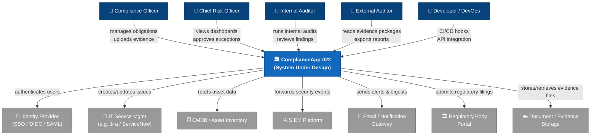

### 3.2 Technical Context

The technical context diagram shows the communication channels and protocols between
ComplianceApp-022 and its external systems.

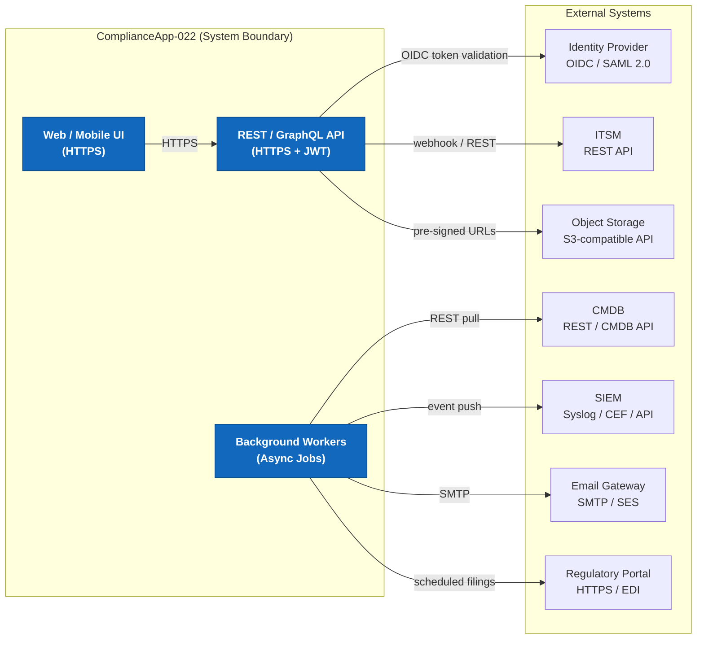

### 3.3 AI Automation Subsystem Context

ComplianceApp-022 includes an embedded multi-agent AI framework (visible via
`.github/agents/`) that automates code analysis and architecture documentation. This
subsystem is an **internal toolchain** — it is not part of the compliance product itself.

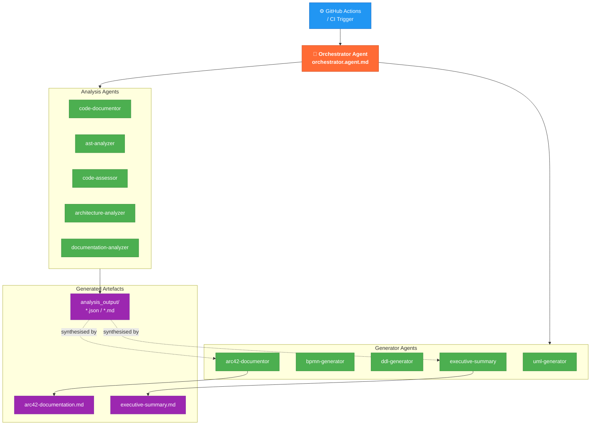

---

## 4. Solution Strategy

### 4.1 Core Technology Decisions

The following high-level technology choices define the solution strategy. Concrete
technology selections are `[TBD]` and will be formalised as ADRs once the engineering
team is assembled.

| Decision Area | Direction | Rationale |
|--------------|-----------|-----------|
| **Architecture Style** | Modular Monolith → Microservices migration path | Start fast; scale domains independently as needed |
| **Frontend** | Single-Page Application (SPA) | Rich interactive dashboards; offline capability |
| **Backend API** | RESTful API with versioning (`/api/v1/…`) | Wide ecosystem; predictable for integration partners |
| **Data Store** | Relational DB (primary) + Event Store (audit log) | ACID compliance for records; append-only log for audit |
| **Auth** | OAuth 2.0 + OIDC with external IdP delegation | Zero password storage; enterprise SSO support |
| **Async Processing** | Message queue / event bus | Decouple long-running tasks (evidence ingestion, filings) |
| **Infrastructure** | Container-based (Docker/Kubernetes) | Portability; cloud-agnostic deployment |
| **AI Automation** | Multi-agent framework via `.github/agents/` | Automated code analysis & documentation generation |

### 4.2 Decomposition Approach

The system is decomposed into **bounded contexts** aligned with the compliance domain:

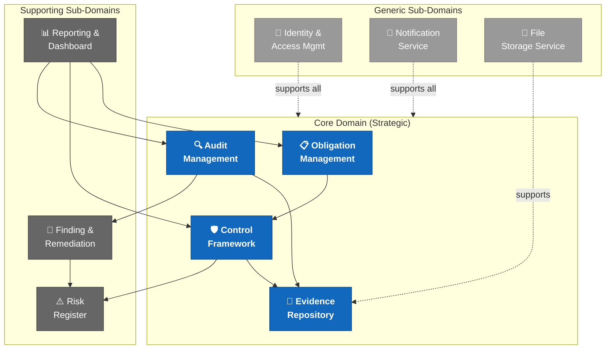

### 4.3 Quality Goal → Strategy Mapping

| Quality Goal | Architectural Strategy |
|-------------|----------------------|
| Data Integrity | Event-sourced audit log; database constraints; checksum verification on evidence files |
| Security | Zero-trust network policy; mTLS between services; RBAC; secrets management (Vault) |
| Auditability | Dedicated append-only Audit Log service; immutable event stream |
| Availability | Horizontal pod autoscaling; circuit breakers; health checks; multi-AZ deployment |
| Extensibility | Plugin-based framework-loader; configuration-driven control mapping |
| Usability | User research-driven UX; design system with accessibility baked in |

---

## 5. Building Block View

### 5.1 Level 1 — System Decomposition

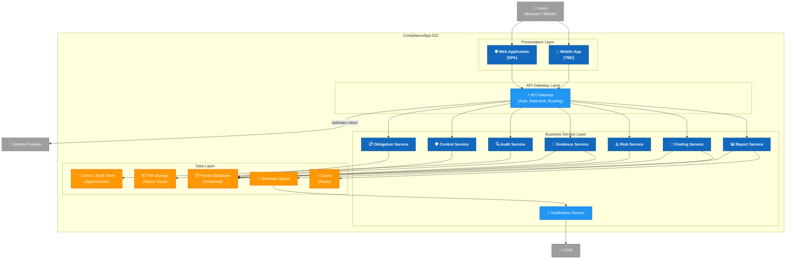

### 5.2 Level 2 — Obligation Management Service (Detailed)

This bounded context handles the full lifecycle of compliance obligations.

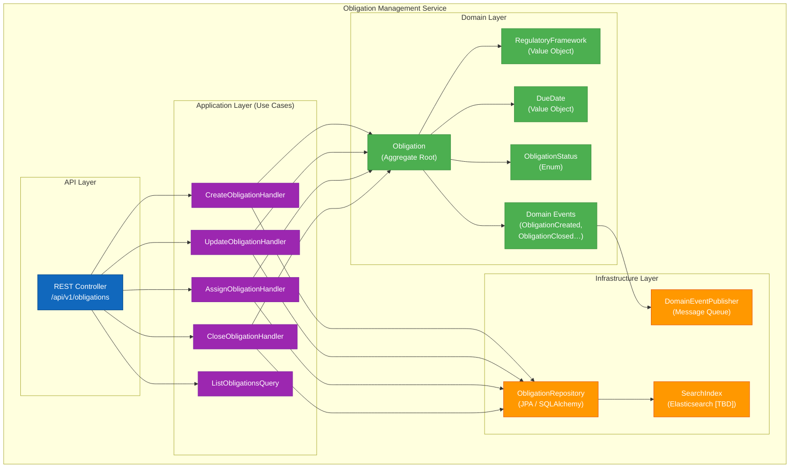

### 5.3 Level 3 — Core Domain Class Structure

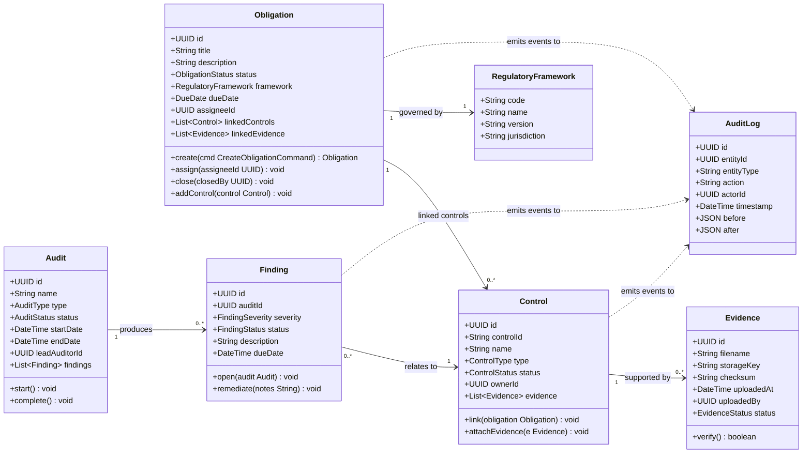

---

## 6. Runtime View

### 6.1 Scenario: User Login and Obligation Dashboard Load

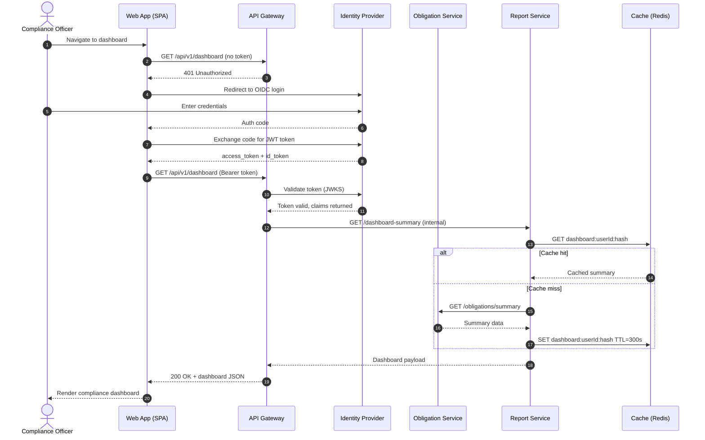

### 6.2 Scenario: Evidence Upload and Verification

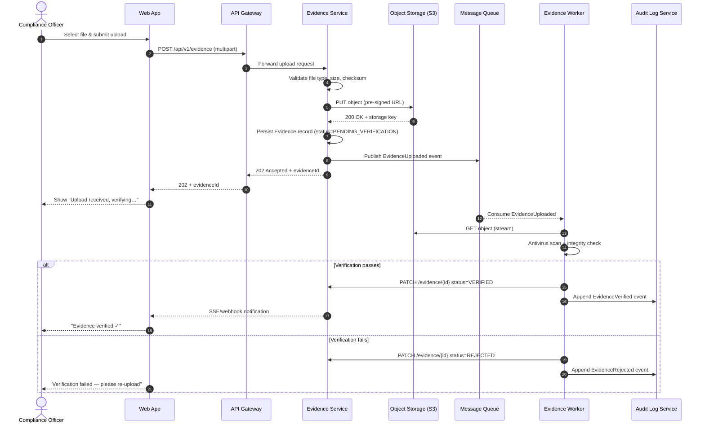

### 6.3 Scenario: Audit Workflow (BPMN-equivalent)

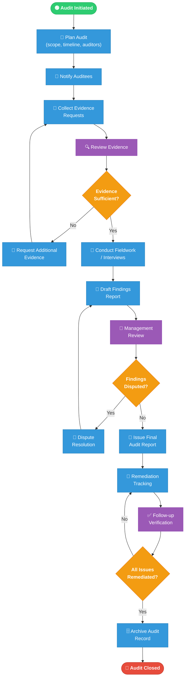

### 6.4 Scenario: Automated Documentation Generation (AI Agent Pipeline)

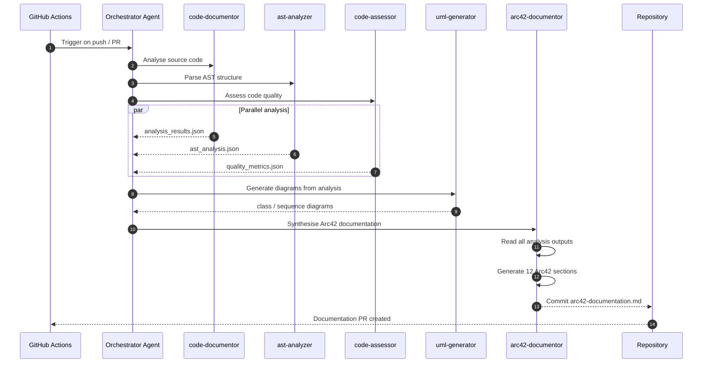

---

## 7. Deployment View

### 7.1 Target Deployment Topology

The target deployment is a **container-based, cloud-native** architecture. The specific
cloud provider is `[TBD]` — the design is intentionally cloud-agnostic, using standard
Kubernetes primitives.

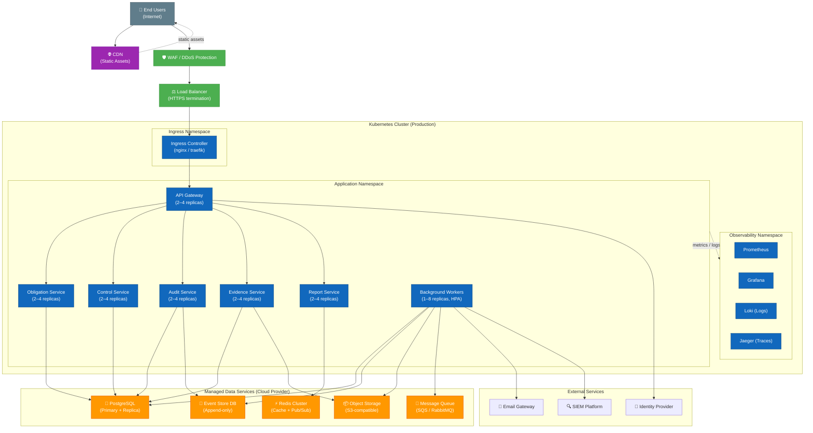

### 7.2 CI/CD Pipeline

```mermaid
flowchart LR
    classDef stage fill:#1168bd,stroke:#0b4884,color:#fff,font-weight:bold
    classDef gate fill:#F39C12,stroke:#E67E22,color:#fff,font-weight:bold
    classDef env fill:#4CAF50,stroke:#388E3C,color:#fff

    SRC["📝 Developer\nPush / PR"]
    CI_BUILD["🔨 Build\n(compile, lint)"]:::stage
    CI_TEST["🧪 Unit &\nIntegration Tests"]:::stage
    CI_SCAN["🔍 Security Scan\n(SAST, SCA, secrets)"]:::stage
    CI_DOCS["📚 Generate Docs\n(arc42-documentor)"]:::stage
    GATE1{Quality\nGate}:::gate
    BUILD_IMG["🐳 Build &\nPush Container Image"]:::stage
    DEPLOY_DEV["🚀 Deploy to\nDEV"]:::env
    SMOKE["💨 Smoke Tests"]:::stage
    GATE2{Approval\nRequired}:::gate
    DEPLOY_STG["🚀 Deploy to\nSTAGING"]:::env
    E2E["🎭 E2E Tests\n+ Performance"]:::stage
    GATE3{Release\nApproval}:::gate
    DEPLOY_PROD["🚀 Deploy to\nPRODUCTION"]:::env
    MONITOR["📊 Monitor &\nAlert"]:::stage

    SRC --> CI_BUILD --> CI_TEST --> CI_SCAN --> CI_DOCS --> GATE1
    GATE1 -->|Pass| BUILD_IMG
    GATE1 -->|Fail| SRC
    BUILD_IMG --> DEPLOY_DEV --> SMOKE --> GATE2
    GATE2 -->|Approved| DEPLOY_STG
    DEPLOY_STG --> E2E --> GATE3
    GATE3 -->|Approved| DEPLOY_PROD
    DEPLOY_PROD --> MONITOR
```

### 7.3 Environment Overview

| Environment | Purpose | Data | Refresh Cycle |
|------------|---------|------|--------------|
| **Development (DEV)** | Developer testing, feature branches | Synthetic / anonymised | Continuous (on push) |
| **Staging (STG)** | Pre-release validation, UAT | Anonymised production copy | Per release candidate |
| **Production (PROD)** | Live system | Real data (encrypted) | Controlled releases |
| **DR (Disaster Recovery)** | Failover | Replicated from PROD | Continuous replication |

---

## 8. Cross-cutting Concepts

### 8.1 Security Architecture

Security is applied at every layer — it is not an afterthought.

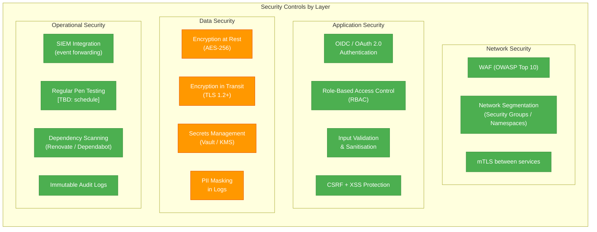

### 8.2 Observability

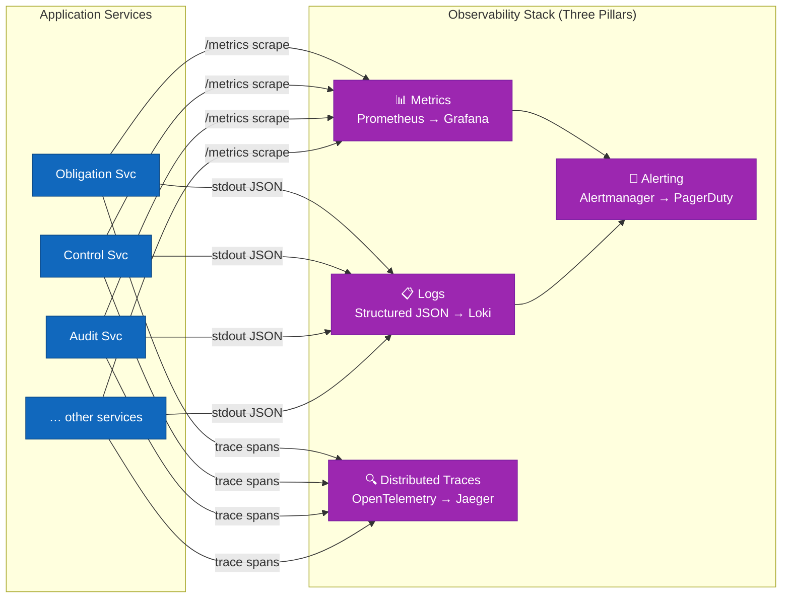

### 8.3 Domain Model — Entity Relationship

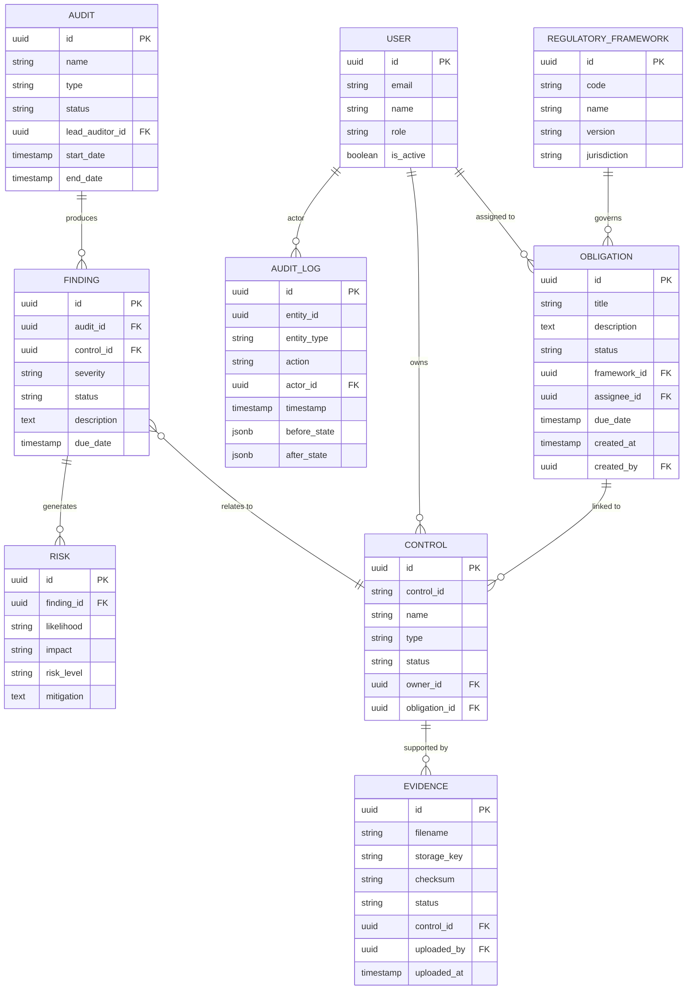

### 8.4 Error Handling Strategy

| Layer | Strategy |
|-------|---------|
| API Gateway | Return RFC 7807 Problem Details JSON; never leak stack traces |
| Services | Domain exceptions map to specific HTTP status codes |
| Async Workers | Dead-letter queue (DLQ) for failed messages; retry with exponential back-off |
| Database | Optimistic locking for concurrent updates; saga pattern for distributed transactions |
| Frontend | Global error boundary; user-friendly messages; automatic retry for transient failures |

### 8.5 Internationalisation (i18n)

| Concern | Approach |
|---------|---------|
| UI text | Externalised to translation files (e.g. `en.json`, `de.json`) |
| Dates / Times | UTC storage; localised display via browser locale |
| Regulatory Frameworks | Jurisdiction-aware model (framework code includes jurisdiction) |
| Audit Reports | Template-based, locale-parameterised |

### 8.6 Business Rules Summary

| ID | Rule | Source |
|----|------|--------|
| BR-01 | An Obligation may not be closed unless all linked Controls are in `EFFECTIVE` status | Domain |
| BR-02 | Evidence must pass antivirus scan before status transitions to `VERIFIED` | Security |
| BR-03 | Findings with severity `CRITICAL` must be acknowledged within 24 hours | Policy |
| BR-04 | Audit reports require sign-off by a user with the `LEAD_AUDITOR` or higher role | Governance |
| BR-05 | Regulatory framework assignments are immutable once an Obligation is `CLOSED` | Integrity |
| BR-06 | Every state change to Obligation, Control, Finding, or Evidence must produce an Audit Log entry | Auditability |
| BR-07 | PII fields must be masked in all log and notification outputs | GDPR |
| BR-08 | Users may only access Obligations within their assigned tenant | Multi-tenancy |

---

## 9. Architecture Decisions

Architecture Decision Records (ADRs) document the key choices made during system design.

### ADR-001: Adopt Arc42 as Architecture Documentation Standard

| Attribute | Value |
|-----------|-------|
| **Status** | Accepted |
| **Date** | 2025-01-01 |
| **Deciders** | Architecture Team |

**Context**: The project needs a structured, repeatable approach to architecture documentation.

**Decision**: Use Arc42 as the standard architecture template for ComplianceApp-022.

**Consequences**: All architecture documentation follows the 12-section Arc42 structure. Mermaid is used for all embedded diagrams.

---

### ADR-002: Multi-Agent AI Framework for Automated Code Analysis

| Attribute | Value |
|-----------|-------|
| **Status** | Accepted |
| **Date** | 2025-01-01 |
| **Deciders** | Architecture Team, DevOps |

**Context**: The project requires automated, repeatable code analysis and documentation as part of the CI/CD pipeline.

**Decision**: Implement a multi-agent framework under `.github/agents/` with specialised agents (orchestrator, code-documentor, ast-analyzer, code-assessor, uml-generator, bpmn-generator, ddl-generator, architecture-analyzer, documentation-analyzer, arc42-documentor, executive-summary).

**Consequences (+)**: Documentation is always up-to-date; architecture drift is detectable automatically.

**Consequences (−)**: Introduces dependency on LLM API services; agent outputs must be human-reviewed before merge.

---

### ADR-003: Event-Sourced Audit Log

| Attribute | Value |
|-----------|-------|
| **Status** | Proposed |
| **Date** | 2025-01-01 |
| **Deciders** | `[TBD]` |

**Context**: Compliance regulations require tamper-evident, immutable records of all changes to compliance-critical entities.

**Decision**: Implement a dedicated append-only event store for all domain events affecting Obligation, Control, Evidence, Audit, and Finding aggregates. The main relational database holds current state; the event store holds the full history.

**Consequences (+)**: Complete audit trail; temporal queries possible; event replay for debugging.

**Consequences (−)**: Increased storage; eventual consistency between event store and read models.

---

### ADR-004: `[TBD]` — Primary Backend Technology Stack

| Attribute | Value |
|-----------|-------|
| **Status** | Proposed |
| **Date** | `[TBD]` |
| **Deciders** | Engineering Lead |

**Context**: `[TBD]` — to be decided based on team skills and ecosystem requirements.

**Options under consideration**: Java/Spring Boot, Python/FastAPI, Node.js/NestJS, Go

**Decision**: `[TBD]`

---

### ADR-005: `[TBD]` — Cloud Provider Selection

| Attribute | Value |
|-----------|-------|
| **Status** | Proposed |
| **Date** | `[TBD]` |
| **Deciders** | CTO, Procurement |

**Context**: `[TBD]` — data residency (GDPR), existing contracts, and cost must be evaluated.

**Decision**: `[TBD]`

---

### ADR-006: Multi-Tenancy Isolation Strategy

| Attribute | Value |
|-----------|-------|
| **Status** | Proposed |
| **Date** | 2025-01-01 |
| **Deciders** | Architecture Team |

**Context**: ComplianceApp-022 is designed as a multi-tenant SaaS platform. Tenant data isolation is a hard security and regulatory requirement.

**Options**: (a) Separate databases per tenant, (b) Shared database with `tenant_id` column, (c) Schema-per-tenant.

**Decision**: `[TBD]` — Recommendation is schema-per-tenant for strong isolation with manageable operational overhead.

**Consequences**: All queries must include tenant context; ORM must enforce row-level isolation.

---

## 10. Quality Requirements

### 10.1 Quality Tree

```mermaid
graph TD
    classDef root fill:#1168bd,stroke:#0b4884,color:#fff,font-weight:bold
    classDef cat fill:#4CAF50,stroke:#388E3C,color:#fff,font-weight:bold
    classDef leaf fill:#E3F2FD,stroke:#1565C0,color:#333

    ROOT["⭐ ComplianceApp-022\nQuality"]:::root

    SEC["🔒 Security"]:::cat
    INT["🔗 Data Integrity"]:::cat
    AUD["📋 Auditability"]:::cat
    AVL["⏱️ Availability"]:::cat
    EXT["🔧 Extensibility"]:::cat
    USE["👤 Usability"]:::cat
    MAINT["🛠️ Maintainability"]:::cat
    PERF["⚡ Performance"]:::cat

    ROOT --> SEC & INT & AUD & AVL & EXT & USE & MAINT & PERF

    SEC --> SEC1["All data encrypted\nat rest + transit"]:::leaf
    SEC --> SEC2["SSO / OIDC\nauthentication"]:::leaf
    SEC --> SEC3["RBAC enforced\nat API layer"]:::leaf
    SEC --> SEC4["Zero trust\nbetween services"]:::leaf

    INT --> INT1["ACID transactions\nfor compliance records"]:::leaf
    INT --> INT2["Checksum verification\nfor evidence files"]:::leaf
    INT --> INT3["Optimistic locking\nfor concurrent updates"]:::leaf

    AUD --> AUD1["Immutable event\naudit log"]:::leaf
    AUD --> AUD2["Every state change\nlogged with actor + diff"]:::leaf
    AUD --> AUD3["Audit log\nnon-repudiable"]:::leaf

    AVL --> AVL1["99.5% uptime SLA\nduring business hours"]:::leaf
    AVL --> AVL2["Multi-AZ\ndeployment"]:::leaf
    AVL --> AVL3["Auto-scaling\npods (HPA)"]:::leaf

    EXT --> EXT1["New frameworks\nvia config, no code change"]:::leaf
    EXT --> EXT2["Plugin API\nfor custom controls"]:::leaf

    USE --> USE1["WCAG 2.1 AA\naccessibility"]:::leaf
    USE --> USE2["Task completion\n< 3 clicks for core tasks"]:::leaf

    MAINT --> MAINT1["Arc42 docs\nauto-generated"]:::leaf
    MAINT --> MAINT2["Test coverage\n> 80% [TBD]"]:::leaf

    PERF --> PERF1["Dashboard load\n< 2 seconds P95"]:::leaf
    PERF --> PERF2["API response\n< 500ms P95"]:::leaf
```

### 10.2 Quality Scenarios

| ID | Quality Attribute | Stimulus | Response | Metric |
|----|-----------------|---------|---------|--------|
| QS-01 | Security | Attacker attempts SQL injection via obligation title field | Input is sanitised; attack is blocked; event logged in SIEM | 0 successful injections in pen test |
| QS-02 | Data Integrity | Two users simultaneously update the same Control status | Optimistic lock conflict detected; second user receives 409; no data corruption | 0 lost updates |
| QS-03 | Auditability | External auditor requests full history of a Finding | Complete event log returned with actor, timestamp, before/after state | 100% of changes traceable |
| QS-04 | Availability | Kubernetes node failure during peak hours | Pod rescheduled within 30s; no user-facing downtime beyond retry window | MTTR < 30 seconds |
| QS-05 | Extensibility | New regulatory framework (e.g. DORA) must be onboarded | Framework configured via admin UI; no code deployment required | < 4 hours onboarding time |
| QS-06 | Performance | 500 concurrent users open compliance dashboard | All dashboards rendered within SLA | P95 < 2 seconds |
| QS-07 | Maintainability | Developer pushes new service code | arc42-documentor automatically updates architecture docs in CI | Documentation current within 1 pipeline run |

### 10.3 Technical Debt Baseline

> ⚠️ **Status**: No source code has been analysed yet. The table below represents **anticipated** technical debt categories for a project of this type. Run `code-assessor` agent once implementation begins to populate real metrics.

| Category | Description | Severity | Recommended Action |
|---------|------------|---------|-------------------|
| TD-01 | No application source code | No codebase exists to assess | CRITICAL | Implement the system |
| TD-02 | README is a stub (`aaa`) | Missing project documentation | HIGH | Replace with proper README |
| TD-03 | No test suite | No automated tests defined | HIGH | Define testing strategy in Sprint 0 |
| TD-04 | No CI/CD pipeline configured | `.github/` contains only agent definitions | HIGH | Configure GitHub Actions workflows |
| TD-05 | ADRs TBD | 3 of 6 ADRs have no decision recorded | MEDIUM | Schedule architecture decisions workshop |
| TD-06 | No dependency manifest | Cannot assess third-party risk | MEDIUM | Create initial `package.json` / `pom.xml` / `requirements.txt` |

---

## 11. Risks and Technical Debt

### 11.1 Risk Register

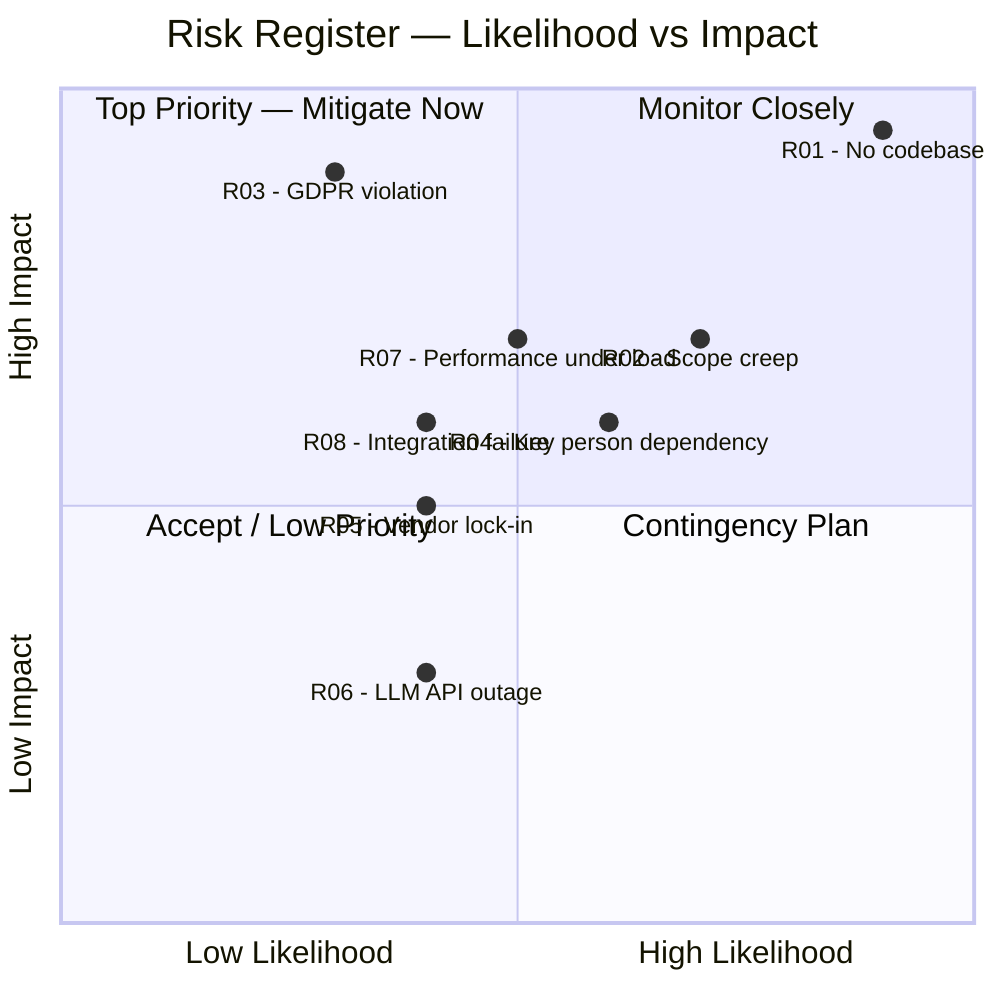

### 11.2 Detailed Risk Table

| ID | Risk | Likelihood | Impact | Mitigation Strategy | Owner |
|----|------|-----------|--------|-------------------|-------|
| R-01 | No application code — system exists only as documentation | HIGH | CRITICAL | Begin Sprint 0 immediately; establish engineering team | Product Owner |
| R-02 | Scope creep from multiple regulatory frameworks | HIGH | HIGH | Define MVP scope; use framework-plugin model; strict backlog management | Product Owner |
| R-03 | GDPR / data residency violation | LOW | CRITICAL | EU-region deployment; data classification; legal review; PII masking | Legal + IT-SEC |
| R-04 | Key person dependency on architecture knowledge | MEDIUM | HIGH | Arc42 docs kept up-to-date via CI/CD; pair programming; knowledge base | Architecture Lead |
| R-05 | Cloud vendor lock-in | MEDIUM | MEDIUM | Use Kubernetes + open standards; avoid proprietary managed services where possible | DevOps |
| R-06 | LLM API outage affects documentation pipeline | MEDIUM | LOW | Documentation generation is non-blocking; CI passes without agent output | DevOps |
| R-07 | Performance degradation under audit season load (many concurrent users) | MEDIUM | HIGH | Load test before each major release; HPA configured; caching strategy | Engineering |
| R-08 | External system integration failure (IdP, ITSM) | MEDIUM | MEDIUM | Circuit breakers; graceful degradation; timeout budgets | Engineering |
| R-09 | Compliance framework changes (regulatory amendments) | LOW | HIGH | Framework-as-config model (ADR-002); monitoring of regulatory updates | Compliance Officer |
| R-10 | Evidence file storage cost explosion | LOW | MEDIUM | Tiered storage (hot/warm/cold); evidence lifecycle management; compression | DevOps |

### 11.3 Technical Debt Items

| ID | Item | Category | Effort | Priority |
|----|------|---------|--------|---------|
| TD-01 | No application source code — entire system is undeveloped | Missing Implementation | XL | CRITICAL |
| TD-02 | README.md contains only `aaa` — no project description | Documentation | XS | HIGH |
| TD-03 | No CI/CD pipeline (GitHub Actions workflows) configured | DevOps | M | HIGH |
| TD-04 | No automated test suite defined | Testing | L | HIGH |
| TD-05 | ADR-004, ADR-005, ADR-006 lack decisions | Architecture | S | MEDIUM |
| TD-06 | Multi-tenancy isolation strategy not finalised | Architecture | M | MEDIUM |
| TD-07 | No database migration tooling configured | Infrastructure | S | MEDIUM |
| TD-08 | No secrets management solution selected | Security | M | HIGH |
| TD-09 | No monitoring / alerting stack configured | Operations | M | MEDIUM |
| TD-10 | No data retention / archival policy defined | Governance | S | MEDIUM |

### 11.4 Recommended Immediate Actions

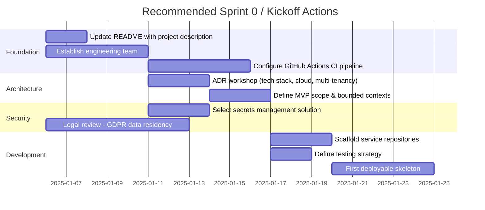

---

## 12. Glossary

| Term | Definition |
|------|-----------|
| **ADR** | Architecture Decision Record — a short document capturing a significant architectural decision, its context, and consequences |
| **Aggregate Root** | A DDD pattern; the entry point for a cluster of domain objects that are treated as a single unit for data changes |
| **Arc42** | A template for software architecture documentation with 12 standardised sections |
| **Audit** | A structured review process to assess compliance with a control framework; produces findings |
| **Audit Log** | An immutable, append-only record of all state changes to compliance-critical entities |
| **Auditee** | An individual or team being audited |
| **Bounded Context** | A DDD pattern; an explicit boundary within which a domain model applies |
| **CMDB** | Configuration Management Database — a repository of IT asset information |
| **Compliance Officer (CO)** | A person responsible for managing and tracking compliance obligations within the organisation |
| **Control** | A specific safeguard or countermeasure that addresses one or more compliance obligations |
| **Control Framework** | A structured set of controls (e.g. ISO 27001, SOC 2, NIST CSF) used to assess compliance |
| **DDD** | Domain-Driven Design — a software development approach focusing on the core domain and domain logic |
| **Dead-Letter Queue (DLQ)** | A message queue holding messages that could not be processed successfully |
| **Evidence** | Documentation or artefacts that demonstrate a control is in place and effective |
| **Finding** | An issue identified during an audit that indicates a gap or weakness in a control |
| **GDPR** | General Data Protection Regulation — EU data protection and privacy law |
| **HPA** | Horizontal Pod Autoscaler — Kubernetes mechanism for scaling pod replicas based on load |
| **ISO 27001** | International standard for information security management systems |
| **LLM** | Large Language Model — the AI backbone of the multi-agent documentation framework |
| **mTLS** | Mutual TLS — both client and server authenticate each other using certificates |
| **Multi-tenancy** | Architecture pattern where a single instance serves multiple isolated tenants |
| **NIST CSF** | NIST Cybersecurity Framework — a voluntary framework for managing cybersecurity risk |
| **Obligation** | A specific regulatory or policy requirement that the organisation must satisfy |
| **OIDC** | OpenID Connect — an authentication layer on top of OAuth 2.0 |
| **PII** | Personally Identifiable Information — any data that can identify an individual |
| **RBAC** | Role-Based Access Control — access permissions assigned based on a user's role |
| **Regulatory Framework** | A set of regulations, standards, or guidelines to which the organisation must adhere (e.g. GDPR, SOC 2) |
| **Remediation** | Actions taken to address and resolve a compliance finding |
| **Risk** | A potential event or condition that could negatively impact compliance posture |
| **SAML 2.0** | Security Assertion Markup Language — a standard for exchanging authentication data |
| **SemVer** | Semantic Versioning — a versioning scheme using MAJOR.MINOR.PATCH format |
| **SIEM** | Security Information and Event Management — a platform for real-time security monitoring |
| **SOC 2** | Service Organization Control 2 — a framework for managing data to protect client interests |
| **SPA** | Single-Page Application — a web app that dynamically rewrites the current page |
| **SSO** | Single Sign-On — allows users to authenticate once and access multiple systems |
| **Tenant** | An isolated customer or business unit using the multi-tenant platform |
| **TLS** | Transport Layer Security — cryptographic protocol for secure communication over a network |
| **WAF** | Web Application Firewall — filters and monitors HTTP requests to protect web applications |
| **WCAG** | Web Content Accessibility Guidelines — standards for web accessibility |

---

*End of Arc42 Architecture Documentation — ComplianceApp-022 (AppNotFound)*

*Generated by: arc42-documentor agent | Version 0.1.0 | 2025-01-01*

*To update this document: push code changes and the arc42-documentor agent will re-generate automatically via CI/CD.*

*Intended storage path: `docs/arc42/arc42-documentation.md` — create the directory and `git mv` this file once the project scaffolding is complete.*
